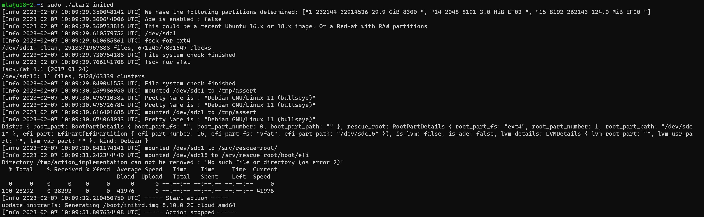

# Standalone

ALAR can be also used from the commandline directly. This is usefull if no recover VM can be created but another Ubuntu 18.04/20.04 VM is available. In that case a copy of the OS image, the one to be recovered, is attached as the first disk (LUN 0).

 **Steps to do this**
 - Copy the alar2 binary from the [release page]( https://github.com/Azure/ALAR/releases) to the recovery VM
 - To fix an initrd issue for example you simply run this command
   `# ./alar2 initrd`
    
    **Note**
    The alar tool needs to be operated with root permissions.

This will result in an output like the following.

## chroot-cli
Another feature ALAR does provide is the `chroot-cli` action. This action can be of help to perform manuell recovery steps with an auto generated chroot environment. To use this feature simply run 
`# ./alar2 chroot-cli` 
